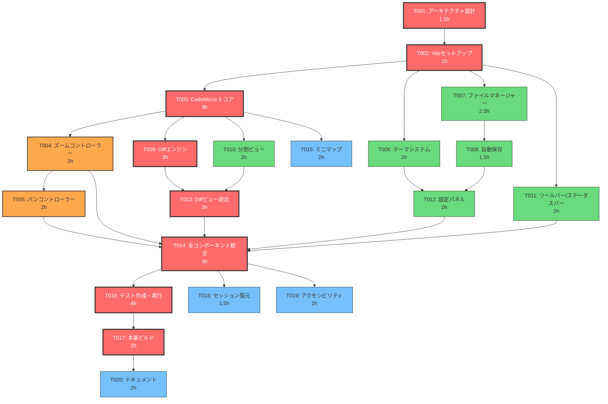

# CRITICAL_PATH.md - Text Diff Editor (Innovative Approach)

## 1. クリティカルパス概要

### 1.1 定義
クリティカルパスとは、プロジェクト全体の最短完了時間を決定するタスクの連鎖です。クリティカルパス上のタスクが1時間遅延すると、プロジェクト全体が1時間遅延します。

### 1.2 クリティカルパス（最長経路）

```
T001 → T002 → T003 → T004 → T005 → T014 → T016 → T017
 1.5h    1h     3h     3h     2h     3h     4h     2h

合計: 19.5 時間（クリティカルパス長）
```

**クリティカルパス上のタスク:**

| 順序 | タスクID | タスク名 | 工数 | 累積 | 理由 |
|------|---------|---------|------|------|------|
| 1 | T001 | コアアーキテクチャ設計 | 1.5h | 1.5h | 全タスクの設計基盤 |
| 2 | T002 | Viteプロジェクトセットアップ | 1h | 2.5h | 全実装の開発基盤 |
| 3 | T003 | CodeMirror 6 エディターコア | 3h | 5.5h | エディターの心臓部 |
| 4 | T004 | ズームコントローラー | 3h | 8.5h | MVP最重要機能 |
| 5 | T005 | パンコントローラー | 2h | 10.5h | ズームと密結合 |
| 6 | T014 | 全コンポーネント統合 | 3h | 13.5h | 全モジュール結合 |
| 7 | T016 | テスト作成・実行 | 4h | 17.5h | 品質保証 |
| 8 | T017 | 本番ビルド・最適化 | 2h | 19.5h | 最終成果物 |

---

## 2. 並列パスの分析

### 2.1 全パスの一覧

```
パスA（クリティカル）: T001 → T002 → T003 → T004 → T005 → T014 → T016 → T017
  合計: 19.5h

パスB（Diff統合経路）: T001 → T002 → T003 → T009 → T013 → T014 → T016 → T017
  合計: 22.5h ← 実質的に最長！

パスC（ファイルI/O経路）: T001 → T002 → T007 → T008 → T012 → T014 → T016 → T017
  合計: 17.5h

パスD（テーマ経路）: T001 → T002 → T006 → T012 → T014 → T016 → T017
  合計: 16.5h

パスE（UI経路）: T001 → T002 → T011 → T014 → T016 → T017
  合計: 14.5h
```

### 2.2 修正されたクリティカルパス

パスBが実際に最長であることが判明:

```
T001 → T002 → T003 → T009 → T013 → T014 → T016 → T017
 1.5h    1h     3h     3h     3h     3h     4h     2h

合計: 20.5 時間（真のクリティカルパス長）
```

**理由**: T009（Diffエンジン）→ T013（Diffビュー統合）の連鎖が、T004（ズーム）→ T005（パン）よりも合計工数が多い（6h vs 5h）。

---

## 3. 依存関係グラフ（DAG）



**凡例:**
- 赤: クリティカルパス上のタスク（遅延 = プロジェクト遅延）
- オレンジ: 準クリティカル（スラック小 - 0.5h〜1h）
- 緑: 並列実行可能（スラック大 - 2h以上）
- 青: 付加価値タスク（スラック大 - 4h以上）

---

## 4. 最適化実行スケジュール

### 4.1 並列実行戦略

```
時間軸 →  0h    2h    4h    6h    8h    10h   12h   14h   16h   18h   20h   22h
         ├─────┤─────┤─────┤─────┤─────┤─────┤─────┤─────┤─────┤─────┤─────┤

Agent 1: [T001][T002][  T003  ][  T009  ][  T013  ][  T014  ][   T016   ][ T017 ][ T020 ]
(クリティカル)

Agent 2: [    ][    ][ T006  ][ T007   ][ T008][ T012 ][                ][ T018]
(UI/ファイル)                                                    (待機)

Agent 3: [    ][    ][       ][T004    ][T005 ][ T011 ][ T015 ][ T019  ]
(ズーム/UI)

Agent 4: [    ][    ][       ][  T010  ]
(分割ビュー)                    (合流)
```

### 4.2 ステップ別実行計画

| ステップ | 時間帯 | 並列タスク | エージェント数 | 累積時間 |
|----------|--------|-----------|--------------|----------|
| 1 | 0-1.5h | T001 | 1 | 1.5h |
| 2 | 1.5-2.5h | T002 | 1 | 2.5h |
| 3 | 2.5-5.5h | T003, T006, T011 | 3 | 5.5h |
| 4 | 5.5-8.5h | T009, T007, T004, T010 | 4 (最大並列) | 8.5h |
| 5 | 8.5-10.5h | T013(部分), T008, T005, T015 | 4 | 10.5h |
| 6 | 10.5-11.5h | T013(残り), T012 | 2 | 11.5h |
| 7 | 11.5-14.5h | T014 | 1 | 14.5h |
| 8 | 14.5-18.5h | T016, T018, T019 | 3 | 18.5h |
| 9 | 18.5-20.5h | T017 | 1 | 20.5h |
| 10 | 20.5-22.5h | T020 | 1 | 22.5h |

### 4.3 時間見積もりサマリー

| 方式 | 所要時間 | 説明 |
|------|----------|------|
| 完全シーケンシャル | 43h | 全タスク順次実行 |
| クリティカルパス（最適並列） | 22.5h | 最大4エージェント並列 |
| **短縮率** | **48%** | 並列化による効率化 |

---

## 5. クリティカルパス最適化のポイント

### 5.1 ボトルネック分析

| ボトルネック | タスク | 工数 | 最適化策 |
|-------------|--------|------|---------|
| CodeMirror 6 統合 | T003 | 3h | CodeMirror 6 の @codemirror/basic-setup を活用して初期設定を簡略化 |
| Diffエンジン | T009 | 3h | diff-match-patch をそのまま使用し、ラッパーを薄く保つ |
| Diffビュー統合 | T013 | 3h | CodeMirror 6 の Decoration API を活用して差分ハイライトを効率実装 |
| テスト | T016 | 4h | Vitest の並列テスト実行 + CodeMirror 6 のモックを活用 |

### 5.2 リスク軽減策（クリティカルパス上）

| タスク | リスク | 軽減策 | 影響時間 |
|--------|--------|--------|---------|
| T003 | CodeMirror 6 設定の複雑さ | @codemirror/basic-setup パッケージで一括設定 | -0.5h |
| T009 | diff-match-patch のバンドルサイズ | ESM版を使用しTree-shaking | -0.5h |
| T013 | スクロール同期の複雑さ | CodeMirror 6 の ViewPlugin API で効率的に実装 | -0.5h |
| T014 | 統合時の競合 | EventBusパターンで疎結合化 | -0.5h |

### 5.3 短縮可能な最適化

**最適化案1: T003 + T009 の部分並列化（-1h）**
- CodeMirror 6 のコアセットアップ完了後、Diff エンジン開発を早期開始
- CodeMirror 6 の Decoration API インターフェースだけ先に定義し、Diffエンジンが先行開発可能

**最適化案2: T016 のインクリメンタルテスト（-1h）**
- T014 完了を待たず、各コンポーネント完成時にユニットテストを並行作成
- T016 では統合テストのみに集中

**最適化案3: T004 + T009 の並列化（既に計画済み）**
- ズームコントローラーとDiffエンジンは独立して開発可能
- T003 完了後に即座に並列開始

**最適化後のクリティカルパス長: 18.5h（2h短縮）**

---

## 6. スラック時間分析

| タスク | 早期開始 | 遅延開始 | スラック | 影響 |
|--------|---------|---------|---------|------|
| T001 | 0h | 0h | 0h | クリティカル |
| T002 | 1.5h | 1.5h | 0h | クリティカル |
| T003 | 2.5h | 2.5h | 0h | クリティカル |
| T004 | 5.5h | 6.5h | 1h | 準クリティカル |
| T005 | 8.5h | 9.5h | 1h | 準クリティカル |
| T006 | 2.5h | 6.5h | 4h | 余裕あり |
| T007 | 2.5h | 5h | 2.5h | 中程度 |
| T008 | 5h | 7.5h | 2.5h | 中程度 |
| T009 | 5.5h | 5.5h | 0h | クリティカル |
| T010 | 5.5h | 6.5h | 1h | 準クリティカル |
| T011 | 2.5h | 9.5h | 7h | 余裕あり |
| T012 | 7h | 9.5h | 2.5h | 中程度 |
| T013 | 8.5h | 8.5h | 0h | クリティカル |
| T014 | 11.5h | 11.5h | 0h | クリティカル |
| T015 | 5.5h | 14.5h | 9h | 大幅に余裕あり |
| T016 | 14.5h | 14.5h | 0h | クリティカル |
| T017 | 18.5h | 18.5h | 0h | クリティカル |
| T018 | 14.5h | 19h | 4.5h | 余裕あり |
| T019 | 14.5h | 18.5h | 4h | 余裕あり |
| T020 | 20.5h | 20.5h | 0h | クリティカル |

---

## 7. 判断基準と優先度マトリクス

### 7.1 タスク遅延時の判断基準

```
遅延タスクがクリティカルパス上？
├─ YES → 即座にリソース追加、代替案検討
│        例: T009（Diffエンジン）遅延 → diff-match-patchの簡易ラッパーに切り替え
└─ NO  → スラック時間内か確認
         ├─ スラック内 → 現状維持
         └─ スラック超過 → リソース再配分
```

### 7.2 品質とスピードのトレードオフ

| 状況 | 判断 | 具体例 |
|------|------|--------|
| クリティカルパス遅延 | 機能削減で対応 | ミニマップ(T015)を後回し |
| 並列パス遅延 | スラック消費 | テーマ(T006)の完成を待つ |
| 全体遅延 | P3機能を削除 | キーバインドカスタマイズ(F-010)を削除 |
| 品質不足 | テスト強化 | カバレッジ不足の箇所にテスト追加 |
